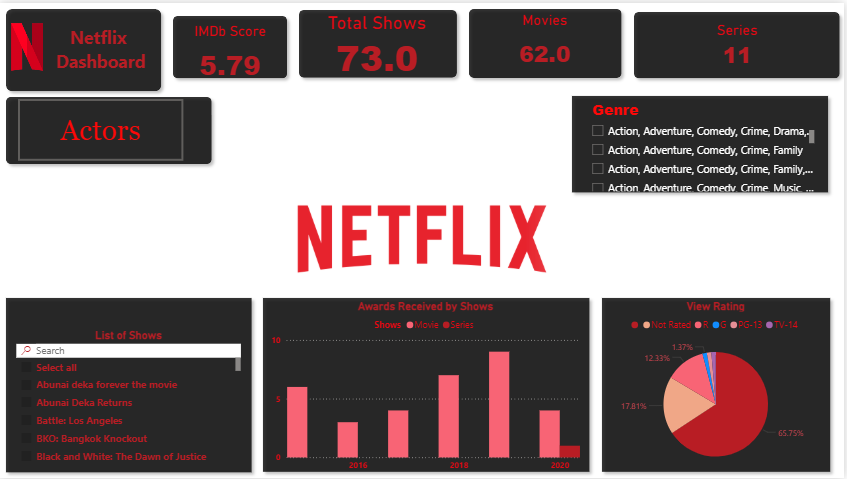

# 🎬 Netflix Content Analysis Dashboard (Power BI)

An interactive Power BI dashboard that explores Netflix's global catalog of movies and TV shows — content mix, release trends, top genres, ratings, and country-wise distribution.


---

## 📌 Overview

This dashboard analyzes **8,807 titles** from Netflix's public catalog (movies + TV shows) to surface patterns in:

- Content type mix (Movies vs. TV Shows)
- How the catalog has grown year over year
- Most common genres and how they compare across regions
- Rating (maturity) distribution
- Top contributing countries

**Objective:** Practice end-to-end BI workflow — cleaning a messy real-world dataset, modeling it in Power BI, and building a clear, decision-ready dashboard.

---

## 🖼️ Dashboard Preview



The report opens on a single canvas with:

- **KPI cards** — IMDb Score, Total Shows, Movies, Series (all update live with the slicers below)
- **Actors** and **Genre** slicers for filtering the whole page by cast member or genre combination
- A searchable **List of Shows** table
- **Awards Received by Shows** — column chart, toggle-able by Shows / Movie / Series, broken out by year
- **View Rating** — pie chart of the maturity-rating split (Not Rated, R, PG-13, TV-14, etc.) for the current selection

> KPI values in the screenshot reflect whatever Genre/Actor filters were active at the time — clear the slicers in Power BI to see totals across the full catalog.

---

## 📂 Repository Structure

```
netflix-dashboard/
│
├── NETFLIX__DASHBOARD_POWER_BI.pbix   # Power BI report file (open in Power BI Desktop)
├── netflix_titles.csv                 # Source dataset
├── screenshots/                       # Dashboard screenshots / GIF walkthrough
│   └── dashboard_overview.png
├── README.md                          # Project documentation (this file)
└── LICENSE
```

---

## 🗂️ Dataset

**Source:** [Netflix Movies and TV Shows – Kaggle](https://www.kaggle.com/datasets/shivamb/netflix-shows)
**File:** `netflix_titles.csv` — 8,807 rows × 12 columns

| Column | Description |
|---|---|
| `show_id` | Unique ID for each title |
| `type` | Movie or TV Show |
| `title` | Title name |
| `director` | Director(s) |
| `cast` | Main cast members |
| `country` | Country of production |
| `date_added` | Date the title was added to Netflix |
| `release_year` | Year of original release |
| `rating` | Content maturity rating |
| `duration` | Runtime (movies) or number of seasons (TV shows) |
| `listed_in` | Genre(s) / category tags |
| `description` | Short synopsis |

*Note: `director`, `cast`, and `country` contain missing values, which are handled explicitly in Power Query (see below). The report's data model also derives an IMDb Score and Awards field per title, layered on top of this base catalog, to power the KPI cards and the Awards chart.*

---

## 🔑 Key Insights

**Across the full catalog (8,807 titles):**
- **Movies dominate the catalog:** 6,131 movies vs. 2,676 TV shows (~70% / 30% split).
- **Catalog growth peaked in 2019**, with 2,016 titles added that year, before slightly declining through 2020–2021.
- **Top genres:** International Movies, Dramas, and Comedies are the three most common categories.
- **TV-MA is the most common rating** (3,207 titles), followed by TV-14 (2,160) — indicating a catalog skewed toward mature audiences.
- **United States (2,818 titles) and India (972 titles)** are the top two content-producing countries by a wide margin.

**In the dashboard itself:** the Genre and Actors slicers let you drill from that full-catalog view down to any combination — e.g. the screenshot above shows a filtered slice of 73 shows (62 movies, 11 series) with an average IMDb score of 5.79, so you can compare a specific genre/actor cohort against the overall averages.

---

## 🛠️ Tools & Techniques

- **Power BI Desktop** — data modeling, DAX measures, report design
- **Power Query** — data cleaning (handling nulls, splitting multi-value genre/country fields, date parsing)
- **DAX** — calculated columns/measures for year-over-year trends and category breakdowns

---

## 🚀 How to Use

1. Clone this repository:
   ```bash
   git clone https://github.com/<your-username>/netflix-dashboard.git
   ```
2. Open `NETFLIX__DASHBOARD_POWER_BI.pbix` in **Power BI Desktop** (free download [here](https://powerbi.microsoft.com/desktop/)).
3. If prompted, point the data source to `netflix_titles.csv` in this repo.
4. Explore the report pages and slicers.

---

## 👤 Author

**Nikhil Jadhav**
[LinkedIn](https://linkedin.com/in/nikhil-jadhav-347520423) · [GitHub](https://github.com/NikhilJadhav07)

---

## 📄 License

This project is licensed under the MIT License — see [LICENSE](LICENSE) for details.
The dataset is publicly available on Kaggle and used here for educational/portfolio purposes only.
